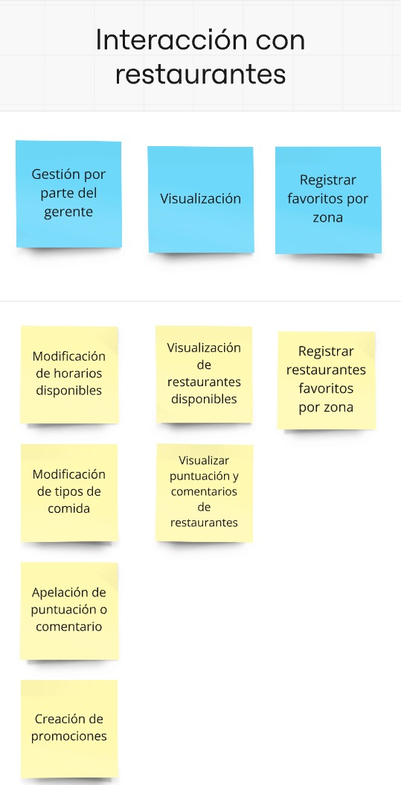
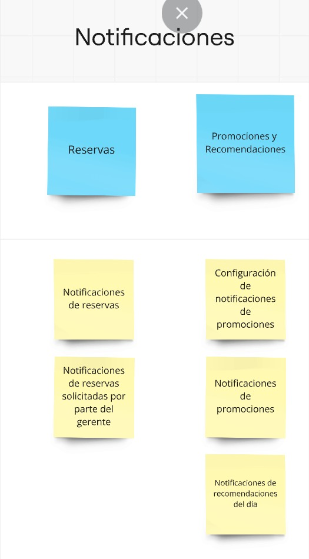

# Ingrey-Katz-Minetti-Symonds

## Índice

1. [Gestión de la iteración](#gestión-de-la-iteración)
    - [Definición del Marco de Trabajo](#definición-del-marco-de-trabajo-scrum)
    - [Roles de equipo y responsabilidades](#roles-del-equipo-y-responsabilidades)
    - [Definition of ready (DoR)](#definition-of-ready-dor)
    - [Definition of done (DoD)](#definition-of-done-dod)

2. [Identificación del problema a resolver](#identificación-del-problema-a-resolver)
    - [Funcionalidades por interesado](#funcionalidades-por-interesado)
    - [Estudio de competidores](#estudio-de-competidores)
    - [Identificación de interesados](#identificación-de-interesados)

3. [Definición del problema/solución](#definición-del-problemasolución)
    - [User stories](#user-stories)
    - [Épicas](#gestión-de-cuentas-de-usuario)
    - [Story map](#story-map)

# GESTIÓN DE LA ITERACIÓN

## Definición del Marco de Trabajo SCRUM

#### Descripción del Marco de Trabajo

- SCRUM se elige como marco de trabajo ágil debido a su capacidad para gestionar cambios frecuentes y la iteración continua de ideas, ideal para el desarrollo de un prototipo de aplicación de reservas y evaluación de restaurantes. Al enfocarse en iteraciones cortas, permite que el equipo ajuste el enfoque en cada sprint según la retroalimentación del Product Owner y los avances en el diseño.

#### Roles del Equipo y Responsabilidades

- Product Owner (PO): Responsable de definir y priorizar las historias de usuario en el Product Backlog, asegurando que cada funcionalidad esté alineada con los objetivos del proyecto y las necesidades de los usuarios.
    -  Integrante: Federico Katz

- Scrum Master (SM): Facilita el cumplimiento del marco de trabajo, asegurando que el equipo siga las prácticas acordadas y resolviendo cualquier obstáculo que pueda surgir. Promueve la mejor a continua a través de retrospectivas y seguimiento de la dinámica del equipo.
    - Integrante: Gastón Minetti

- Equipo de Desarrollo: 
Conformado por los miembros encargados de diseñar y prototipar las funcionalidades, siguiendo las historias priorizadas. Trabajan en cada iteración para completar el Sprint Backlog y asegurar que las entregas cumplan con el Definition of Done (DoD).
Integrantes:
    - Christian Ingrey
    - Emily Symonds

#### Definition of Ready (DoR)

Para que una historia de usuario esté lista para ser trabajada en el prototipo:
- **Narrativa completa y clara:** La historia de usuario debe especificar quién es el usuario, qué quiere lograr y el beneficio o propósito de la funcionalidad (por ejemplo: "Como usuario registrado, quiero recibir notificaciones de promociones para aprovechar descuentos en mis restaurantes favoritos").

- **Criterios de aceptación bien definidos:** La historia debe incluir al menos un escenario de aceptación claro que detalle las condiciones exactas en las que se considerará que la funcionalidad está cumplida.
Especificación de flujo de usuario: El flujo de interacción debe estar detallado desde el primer paso hasta el final, describiendo cómo el usuario interactúa con cada elemento y las pantallas involucradas.
- **Contenido y textos definidos:** Se deben definir todos los textos que aparecerán en la interfaz, incluyendo etiquetas, mensajes y cualquier otro texto que oriente al usuario durante la experiencia.
- **Aprobación del Product Owner:** El Product Owner debe haber revisado y aprobado la historia, asegurando que es relevante, prioritaria y clara para ser trabajada en el prototipo.

#### Definition of Done (DoD)

Para que una historia de usuario esté finalizada en el prototipo:
- **Pantallas y flujo de interacción completados:** Todas las pantallas necesarias están diseñadas en Framer, reflejando fielmente el flujo descrito en los criterios de aceptación y el flujo de usuario detallado en la historia.
- **Interactividad simulada en Framer:** Las interacciones principales están configuradas en Framer, permitiendo una experiencia de usuario que simula los pasos descritos, incluyendo navegación entre pantallas y elementos interactivos, como botones y formularios.
- **Contenido y textos implementados:** Todos los textos definidos en la historia (etiquetas, mensajes, placeholders) están implementados en el prototipo, asegurando que orientan al usuario según lo especificado.
- **Experiencia revisada y aprobada por el Product Owner:** El Product Owner ha revisado el prototipo en Framer y ha confirmado que cumple con los criterios de aceptación y que la experiencia de usuario sigue el flujo especificado.
- **Exportación del prototipo:** El prototipo ha sido exportado en formato de imagen (PNG o JPG) o PDF, y se ha cargado en el repositorio de GitHub para permitir su visualización y consulta por el equipo y las partes interesadas.
- **Documentación de decisiones de diseño en Framer:** Se han añadido comentarios en el proyecto de Framer para documentar cualquier decisión de diseño o cambio significativo en el flujo, asegurando que el equipo y el Product Owner puedan comprender fácilmente el enfoque tomado en el prototipo.

Documentación básica: Las decisiones de diseño y cualquier ajuste importante en el flujo se documentan para referencia en futuras iteraciones.

El objetivo principal de esta primera iteración es lograr una comprensión clara y detallada del problema del negocio que nuestro sistema pretende resolver. Esto incluye la identificación de los principales interesados (usuarios, administradores y gerentes) y la lista de funcionalidades críticas que satisfacen las necesidades de cada uno de ellos.

Se busca, además, analizar el valor que cada funcionalidad proporciona a los usuarios y cómo estas se alinean con los objetivos del negocio. Parte del proceso involucra un estudio comparativo con soluciones de competidores, lo que nos permitirá identificar oportunidades de mejora y diferenciación en el mercado.

El resultado esperado de esta iteración es contar con un Product Backlog jerarquizado, que incluya tanto épicas como historias de usuario, cada una acompañada de sus respectivos criterios de aceptación. Este backlog permitirá priorizar y validar los primeros prototipos en las siguientes etapas, asegurando que el ciclo de descubrimiento de la solución sea eficaz y eficiente.

Comenzamos a trabajar en la iteración luego de que el scrum master fijará la primera reunión para que cada integrante informe sus avances.

En dicha reunión, se trataron los siguientes temas:

Luego, planificamos para tener otra daily, donde el trabajo que había realizado cada integrante fue el siguiente:

Una vez finalizada la iteración, tuvimos una revisión donde analizamos el backlog generado, y llegamos a la conclusión de que todos nos encontrábamos conformes con el trabajo realizado.

En cuanto al registro de horas trabajadas, utilizamos Clockify para determinar cuánto tiempo nos llevó realizar cada tarea, quedando de la siguiente manera:

Christian Ingrey:

Federico Katz:

Gastón Minetti:

Emily Symonds: 

Christian Ingrey:

## IDENTIFICACIÓN DEL PROBLEMA A RESOLVER

#### Funcionalidades por interesado:

<u>Usuarios</u>
- Registro (mail, nombre de usuario, contraseña o via google)
- Login (nombre usuario y contraseña o login de google, opción de recuperar contraseña)
- Logout
- Edición de perfil (todo menos el mail)
- Registrar restaurantes favoritos por zona
- Posibilidad de recibir notificaciones de promociones de los restaurantes favoritos y confirmaciones de reserva
- Posibilidad de recibir notificaciones de recomendaciones del día en base a el historial de reservas y valoraciones
- Perfil que muestra nombre de usuario, avatar, restaurantes favoritos, recomendaciones realizadas, historial de visitas a restaurantes
- Solicitar una reserva en restaurante existente y que permita reservas (selecciona restaurante, cantidad de personas y horario).
- Cancelación de reserva
- Visualizar el estado de una reserva
- Visualizar puntuación y comentarios de restaurantes
- Visualizar restaurantes disponibles por zona (puede incluir mapa interactivo), rango de precios y valoraciones (en ranking).
- Recibir notificaciones de reservas confirmadas

<u>Gerenciador</u>
- Registro (realizado por administrador)
- Confirmar reserva para su restaurante
- Modificar horarios disponibles y tipos de comida
- Apelar puntuación o comentarios en su restaurante
- Recibir notificaciones de reservas solicitadas para su restaurante
- Crear promociones para sus restaurantes

<u>Administrador</u>
- Registrar restaurantes (con dirección, tipo de comida y horarios)
- Registrar y modificar gerenciadores por cada restaurante
- Indicar restaurantes en los que se pueden realizar reservas
- Administrar comentarios y puntuaciones

#### Estudio de competidores:

<u>Pedido Ya</u>
- Fortalezas:
    - Cobertura amplia en varios países de Latinoamérica.
    - App intuitiva y fácil de usar.
    - Diversos métodos de pago (tarjetas, efectivo, e-wallets).
    - Notificaciones en tiempo real sobre el estado del pedido.
    - Sistema de valoraciones y comentarios que mejora la calidad del servicio.
    - Promociones frecuentes que fomentan la lealtad de los usuarios.

- Debilidades:
    - Enfoque limitado en delivery, sin integración de reservas de mesas.
    - Falta de personalización avanzada en recomendaciones.
    - Tiempos de entrega inconsistentes en algunas áreas.
    - Comisiones altas para restaurantes, lo que afecta la oferta.

- Oportunidades:
    -  Integrar reservas de mesas para ampliar su oferta.
    - Personalización de recomendaciones basadas en hábitos de consumo.
    - Mejorar la experiencia de los restaurantes con mejores herramientas y soporte.
    - Expandir la oferta a nuevas categorías como farmacias o supermercados.

<u>Rappi</u>
- Fortalezas:
    - Servicio de delivery multidimensional (comida, compras, farmacias, etc.).
    - Programa de suscripción (RappiPrime) que ofrece beneficios exclusivos.
    - App fácil de usar, con opciones de múltiples servicios en una sola plataforma.
    - Personalización de pedidos y entrega.
- Debilidades:
    - En algunos lugares, el tiempo de entrega puede ser inconsistente.
    - La atención al cliente puede ser lenta en resolver problemas de usuarios.
    - Enfoque mayormente en la entrega, con limitada funcionalidad de reserva o experiencia en el lugar.
- Oportunidades:
    - Integrar un sistema de reservas en restaurantes como un nuevo servicio.
    - Mejorar la experiencia post-venta, ofreciendo soporte más rápido y personalizado.

<u>UberEats</u>
- Fortalezas:
    - Marca mundialmente conocida con una amplia base de usuarios.
    - Servicio rápido y fiable en áreas urbanas.
    - Interfaz intuitiva con seguimiento de pedidos en tiempo real.
    - Sistema de recompensas y descuentos.
- Debilidades:
    - Comisiones elevadas para restaurantes y usuarios.
    - Limitada personalización de la experiencia de usuario más allá de la entrega.
    - Algunas áreas pueden tener baja cobertura de restaurantes.
- Oportunidades:
    - Ampliar las opciones para reserva de mesas en restaurantes.
    - Focalizarse más en la personalización de ofertas según las preferencias del usuario.

<u>Google Maps</u>
- Fortalezas:
    - Información amplia y accesible sobre restaurantes (ubicación, horario, reseñas).
    - Funcionalidad de mapas detallados y opciones de navegación.
    - Acceso a reseñas verificadas por usuarios y fotos de los lugares.
    - Integración con múltiples servicios como reservas, llamada directa, etc.
- Debilidades:
    - No tiene su propio sistema de delivery o reservas, depende de terceros.
    - La información de algunos establecimientos puede no estar actualizada.
- Oportunidades:
    - Integrar más funciones de interacción directa con restaurantes, como reservas o pedidos.
    - Mejorar las notificaciones para eventos y promociones de restaurantes.

<u>TripAdvisor</u>
- Fortalezas:
    - Reseñas detalladas y verificadas por una amplia comunidad de viajeros.
    - Comparación de precios y disponibilidad en restaurantes y hoteles.
    - Plataforma globalmente reconocida, usada en planificación de viajes y comidas.
- Debilidades:
    - Focalización más en turistas que en usuarios locales o recurrentes.
    - La interfaz puede resultar abrumadora debido a la gran cantidad de información.
- Oportunidades:
    - Enfocar más en usuarios locales con ofertas personalizadas.
    - Expandir la funcionalidad para incluir sistemas de entrega o de reserva inmediata en restaurantes.

#### Identificación de interesados:

- Usuarios finales
- Gerenciadores de restaurantes
- Administradores de la plataforma

<u>Usuarios finales</u>

Personas entre 20 y 70 años que salen a almorzar o cenar con frecuencia. Estos usuarios buscan una manera fácil de reservar restaurantes, explorar opciones y compartir opiniones sobre sus experiencias.

**Escenarios principales con su valor de negocio asociados:**

- Reserva de restaurante
    - Escenario: un usuario solicita una reserva seleccionando el restaurante, cantidad de horas y horario.
    - Valor de negocio asociado: Facilita el flujo de clientes hacia los restaurantes, maximizando la ocupación y aumentando las ventas. Además, al tener un sistema de reservas centralizado, los restaurantes pueden gestionar mejor su capacidad.
- Exploracion de restaurantes
    - Escenario: El cliente explora restaurantes disponibles según la zona, precio, valoración, y tipo de comida, visualizando información relevante
    - Valor de negocio asociado: Aumenta la tasa de conversión de usuarios a reservas efectivas y facilita la ocupación de mesas para los restaurantes.
- Visualización de reserva
    - Escenario: un usuario solicita una reserva seleccionando el restaurante, cantidad de personas y horario.
    - Valor de negocio asociado: Disminuye la necesidad de que los usuarios contacten al restaurante directamente para verificar sus reservas, lo que optimiza la gestión operativa del restaurante y mejora la experiencia del cliente.
- Cancelación de reserva
    - Escenario: un usuario cancela una reserva previamente realizada en su perfil.
    - Valor del negocio asociado: Al ofrecer una opción de cancelación fácil, se reduce la cantidad de reservas fantasma (clientes que no van al restaurante al momento de la reserva), permitiendo a los restaurantes optimizar su ocupación y liberar mesas para otros clientes. Además, los clientes aprecian la flexibilidad de cancelar si sus planes cambian, lo que aumenta su satisfacción y la probabilidad de que utilicen la plataforma nuevamente.
- Elegir restaurante según sus reseñas
    - Escenario: un usuario utiliza las valoraciones y comentarios para poder elegir el mejor restaurante.
    - Valor del negocio asociado: Aumenta la confianza del cliente en su decisión de reserva, lo que puede aumentar el número de reservas exitosas y por lo tanto la fiabilidad por parte de los clientes en la aplicación. Los comentarios positivos también ayudan a mejorar la reputación de los restaurantes en la plataforma.
- Notificaciones de recomendaciones del dia
    - Escenario: un cliente recibe una notificación de una recomendación del día
    - Valor del negocio asociado: mejora la interacción del usuario con la aplicación al ofrecer contenido personalizado, aumentando el uso de la aplicación por parte del cliente y su satisfacción para futuras reservas. Además, estas recomendaciones aumentaran las reservas de los restaurantes o promoverá la experimentación del cliente a restaurantes nunca visitados.

<u>Gerentes de restaurantes</u>

Son los responsables de la administración de restaurantes asociados a la plataforma. Buscan gestionar sus reservas de manera eficiente, monitorear las reseñas y mejorar la visibilidad del restaurante.

**Escenarios principales con su valor de negocio asociados:**

- Confirmación y gestión de reservas
    - Escenario: El gerente recibe notificaciones de reservas solicitadas y las confirma o modifica según la disponibilidad del restaurante.
    - Valor del negocio asociado: Optimiza la gestión de mesas del restaurante, reduce los errores de reserva y mejora la experiencia del cliente. 
- Creación de promociones
    - Escenario: El gerente crea promociones para atraer a más clientes, como descuentos en horarios específicos o días de la semana.
    - Valor del negocio asociado: Aumenta el tráfico de clientes en momentos de baja demanda, generando ingresos para el restaurante.
- Gestión de comentarios y valoraciones
    - Escenario: El gerente revisa y responde comentarios y reseñas, y puede apelar puntuaciones que considere injustas.
    - Valor del negocio asociado:  Mantiene la reputación del restaurante y mejora la relación con los clientes.
- Modificación de horarios y menu
    - Escenario: El gerente puede ajustar los horarios y tipos de comida ofrecidos según la disponibilidad o nuevas ofertas del restaurante.
    - Valor del negocio asociado: Permite una mayor flexibilidad a los restaurantes y permite atraer nuevos clientes mediante la actualización de la oferta.

<u>Administradores</u>

Son los encargados de gestionar la aplicación y supervisar el buen funcionamiento de los restaurantes, clientes y gerentes en la plataforma. Su enfoque está en garantizar la calidad del servicio y la escalabilidad de la plataforma.

**Escenarios principales con su valor de negocio asociados:** 

- Alta de restaurantes
    - Escenario: El administrador da de alta nuevos restaurantes en la plataforma, añadiendo información como la ubicación, tipo de comida y horarios.
    - Valor del negocio asociado: Aumenta la oferta de restaurantes, asegura la calidad de la información proporcionada a los usuarios.
- Asignación de gerentes a los restaurantes
    - Escenario: El administrador asigna a gerentes específicos a los restaurantes dentro de la plataforma para asegurar una adecuada gestión de las reservas y reseñas.
    - Valor del negocio asociado: Optimiza la administración de los restaurantes.
- Supervisión de comentarios y puntuaciones
    - Escenario: El administrador monitorea los comentarios y las puntuaciones para asegurarse de que cumplen con las políticas de la plataforma.
    - Valor de negocio asociado: Mantiene la integridad de las reseñas y evita problemas reputacionales.

## DEFINICIÓN DEL PROBLEMA/SOLUCIÓN

## User Stories 

### Historia de Usuario 1: Login del sistema

**Título:** Registro de un nuevo usuario

**Narrativa:**
- **Como** un usuario final de la aplicación
- **Quiero** registrarme en la plataforma utilizando mi correo electrónico o cuenta de Google
- **Para** poder acceder a todas las funcionalidades y realizar reservas en restaurantes

**Criterios de Aceptación:**

**Escenario 1: Registro por correo electrónico**

- **Dado** que estoy en la pantalla de registro
- **Y** he ingresado un correo electrónico, nombre de usuario y contraseña válidos
- **Cuando** hago clic en el botón de "Registrar"
- **Entonces** debería recibir un correo de confirmación
- **Y** mi cuenta debería ser creada correctamente en el sistema.

**Escenario 2: Registro mediante cuenta de Google**
- **Dado** que estoy en la pantalla de registro
- **Y** he seleccionado la opción de registro con Google
- **Cuando** acepto los permisos de Google para compartir mi información
- **Entonces** debería ser registrado automáticamente en la plataforma
- **Y** debería poder acceder a mi perfil en la aplicación.

### Historia de Usuario 2: Recuperar contraseña

**Título:** Recuperar contraseña

**Narrativa:**
- **Como** usuario registrado 
- **Quiero** recuperar mi contraseña cuando la haya olvidado
- **Para** poder restablecer mi acceso a la aplicación sin perder mi cuenta.

**Criterios de Aceptación:**

**Escenario 1: Solicitud de recuperación de contraseña:**
- **Dado** que estoy en la pantalla de inicio de sesión.
- **Y** no recuerdo mi contraseña.
- **Cuando** haga clic en el enlace de "¿Olvidaste tu contraseña?".
- **Entonces** debería ser redirigido a una pantalla donde puedo ingresar mi dirección de correo electrónico registrada.
- **Y** debería ver un botón para solicitar el restablecimiento de la contraseña.

**Escenario 2: Envío de correo de recuperación de contraseña:**
- **Dado** que he ingresado una dirección de correo electrónico válida en el formulario de recuperación de contraseña.
- **Cuando** haga clic en el botón de "Enviar".
- **Entonces** debería ver un mensaje confirmando que se ha enviado un correo electrónico con un enlace para restablecer la contraseña a la dirección proporcionada.
- **Y** debería recibir un correo electrónico con un enlace único para restablecer mi contraseña.

**Escenario 3: Restablecimiento de contraseña exitoso:**
- **Dado** que he recibido un correo electrónico con el enlace para restablecer mi contraseña.
- **Cuando** hago clic en el enlace del correo.
- **Entonces** debería ser redirigido a una pantalla donde puedo ingresar una nueva contraseña.
- **Y** al ingresar una nueva contraseña válida y confirmar, debería ver un mensaje indicando que mi contraseña se ha restablecido exitosamente.
- **Y** debería poder iniciar sesión con mi nueva contraseña inmediatamente.

**Escenario 4: Fallo en la recuperación por correo no registrado:**
- **Dado** que he ingresado una dirección de correo electrónico en el formulario de recuperación de contraseña.
- **Y** la dirección de correo no está registrada en la plataforma.
- **Cuando** haga clic en "Enviar".
- **Entonces** debería ver un mensaje de error indicando que la dirección de correo electrónico no está asociada a ninguna cuenta.

### Historia de Usuario 3: Logout del sistema
**Título:** Cerrar sesión

**Narrativa:**
- **Como** usuario registrado
- **Quiero** cerrar sesión en la aplicación
- **Para** proteger mis datos personales cuando no utilizo el servicio

**Criterios de Aceptación:**

**Escenario 1: Cierre de sesión exitoso**

- **Dado** que estoy autenticado en mi cuenta
- **Cuando** hago clic en "Cerrar sesión"
- **Entonces** debería ser redirigido a la pantalla de inicio de sesión
- **Y** debería estar desconectado del sistema.

### Historia de Usuario 4: Edición de perfil

**Título:** Editar perfil de usuario

**Narrativa:**

- **Como** usuario registrado
- **Quiero** editar mi perfil
- **Para** actualizar mi información personal, como el avatar, nombre de usuario y restaurantes favoritos

**Criterios de Aceptación:**

**Escenario 1: Edición del perfil sin modificar el correo**

- **Dado** que estoy en mi perfil de usuario
- **Y** quiero cambiar mi avatar o nombre de usuario
- **Cuando** hago clic en "Guardar cambios"
- **Entonces** debería ver un mensaje de confirmación de que los cambios han sido aplicados exitosamente
- **Y** debería ver la información actualizada en mi perfil.

### Historia de Usuario 5: Realizar una reserva en un restaurante

**Título:** Realización de reserva en un restaurante

**Narrativa:**

- **Como** usuario registrado
- **Quiero** realizar una reserva en un restaurante
- **Para** asegurarme de tener mesa disponible en la fecha y horario que deseo

**Criterios de Aceptación:**

**Escenario 1: Realización de reserva exitosa**
- **Dado** que estoy en la pantalla de un restaurante que permite reservas
- **Y** he seleccionado la fecha, hora y cantidad de personas
- **Cuando** hago clic en el botón de "Reservar"
- **Entonces** debería ver un mensaje de confirmación de reserva
- **Y** debería recibir una notificación con los detalles de la reserva.

**Escenario 2: Fallo en la reserva por falta de disponibilidad**

- **Dado** que estoy en la pantalla de un restaurante
- **Y** he seleccionado una fecha y hora que ya está reservada
- **Cuando** intento hacer la reserva
- **Entonces** debería ver un mensaje que me indique que no hay disponibilidad para esa fecha y hora
- **Y** debería poder seleccionar otra fecha u hora disponible.

### Historia de Usuario 6: Registrar restaurantes favoritos por zona

**Título:** Agregar restaurantes favoritos

**Narrativa:**

- **Como** usuario registrado
- **Quiero** agregar restaurantes a mi lista de favoritos por zona
- **Para** poder acceder rápidamente a ellos y recibir notificaciones de promociones

**Criterios de Aceptación:**

**Escenario 1: Agregar restaurantes favoritos**

- **Dado** que estoy en la página de un restaurante
- **Y** quiero agregarlo a mis favoritos
- **Cuando** hago clic en "Agregar a favoritos"
- **Entonces** el restaurante debería aparecer en mi lista de favoritos en mi perfil.

### Historia de Usuario 7: Configuración de notificaciones de promociones

**Título:** Configuración de promociones

**Narrativa:** 

- **Como** usuario registrado
- **Quiero** configurar mi usuario
- **Para** recibir notificaciones

**Criterios de Aceptación:**

**Escenario 1: Configuración de notificaciones:**
- **Dado** que soy un usuario registrado y quiero gestionar mis notificaciones.
- **Cuando** accedo a la configuración de notificaciones en mi perfil.
- **Entonces** debería poder activar o desactivar las notificaciones de promociones para cada restaurante favorito.

### Historia de Usuario 8: Notificaciones de promociones

**Título:** Notificaciones de promociones

**Narrativa:**

- **Como** usuario registrado
- **Quiero** recibir notificaciones de promociones de mis restaurantes favoritos 
- **Para** estar informado de las mejores ofertas

**Criterios de Aceptación:**

**Escenario 1: Notificaciones de promociones**
- **Dado** que tengo restaurantes en mi lista de favoritos
- **Cuando** una promoción es lanzada por el restaurante
- **Entonces** debería recibir una notificación con los detalles de la promoción.

### Historia de Usuario 9: Notificaciones de reservas

**Título:** Notificaciones de reservas

**Narrativa:**

- **Como** usuario registrado
- **Quiero** recibir notificaciones de las reservas a los restaurantes
- **Para** estar informado acerca de mis reservas

**Criterios de Aceptación:**

**Escenario 1: Notificación de confirmación de reserva:**
- **Dado** que he realizado una reserva en un restaurante.
- **Cuando** la reserva sea confirmada por el restaurante.
- **Entonces** debería recibir una notificación confirmando la reserva, con detalles como el nombre del restaurante, la fecha, la hora y la cantidad de personas.

**Escenario 2: Notificación de modificación de reserva:**
- **Dado** que he realizado una reserva en un restaurante.
- **Cuando** el restaurante modifique la reserva (por ejemplo, un cambio de horario).
- **Entonces** debería recibir una notificación que incluya la modificación hecha, con los detalles actualizados de la reserva.

**Escenario 3: Notificación de cancelación de reserva:**
- **Dado** que he realizado una reserva en un restaurante.
- **Cuando** el restaurante cancele la reserva por alguna razón (ejemplo: evento cerrado, fuerza mayor).
- **Entonces** debería recibir una notificación de cancelación, con una explicación y, si es posible, opciones para realizar una nueva reserva.

### Historia de Usuario 10: Visualización de status de una reserva

**Título:** Visualización de estatus de una reserva

**Narrativa:**

- **Como** usuario registrado
- **Quiero** visualizar el estatus de mis reservas
- **Para** poder verificar si han sido confirmadas, modificadas o canceladas por el restaurante.

**Criterios de Aceptación:**

**Escenario 1: Visualización de reserva confirmada:**
- **Dado** que he realizado una reserva en un restaurante.
- **Y** la reserva ha sido confirmada por el restaurante.
- **Cuando** accedo a la sección de "Mis Reservas" en mi perfil.
- **Entonces** debería ver el estatus de la reserva como "Confirmada", junto con los detalles de la misma, como el nombre del restaurante, la fecha, la hora y la cantidad de personas.

**Escenario 2: Visualización de reserva pendiente:**
- **Dado** que he solicitado una reserva, pero el restaurante aún no ha confirmado.
- **Cuando** accedo a la sección de "Mis Reservas".
- **Entonces** debería ver el estatus de la reserva como "Pendiente", indicando que la reserva aún no ha sido confirmada por el restaurante.

**Escenario 3: Visualización de reserva cancelada:**
- **Dado** que el restaurante ha cancelado mi reserva.
- **Cuando** accedo a la sección de "Mis Reservas".
- **Entonces** debería ver el estatus de la reserva como "Cancelada", junto con una explicación del motivo de la cancelación.

**Escenario 4: Visualización de reserva modificada:**
- **Dado** que el restaurante ha modificado mi reserva (por ejemplo, un cambio de horario o de mesa).
- **Cuando** accedo a la sección de "Mis Reservas".
- **Entonces** debería ver el estatus de la reserva como "Modificada", junto con los detalles actualizados (ejemplo: nueva hora) y una explicación del cambio.

### Historia de Usuario 11: Notificaciones de recomendaciones del día

**Título:** Notificaciones de recomendaciones del día

**Narrativa:**
- **Como** usuario registrado
- **Quiero** recibir notificaciones de recomendaciones diarias en base a mi historial de reservas y valoraciones
- **Para** descubrir nuevos restaurantes y platos que podrían interesarme

**Criterios de Aceptación:**

**Escenario 1: Notificación de recomendación del día**
- **Dado** que tengo un historial de valoraciones y reservas
- **Cuando** se genera una recomendación personalizada
- **Entonces** debería recibir una notificación con el restaurante o plato recomendado.

### Historia de Usuario 12: Visualización de perfil de usuario

**Título:** Visualización del perfil de usuario

**Narrativa:**
- **Como** usuario registrado
- **Quiero** visualizar mi perfil que incluya nombre de usuario, avatar, restaurantes favoritos, recomendaciones realizadas y mi historial de visitas a restaurantes
- **Para** revisar y gestionar mi actividad dentro de la aplicación

**Criterios de Aceptación:**

**Escenario 1: Visualización del perfil completo**
- **Dado** que estoy autenticado en mi cuenta
- **Cuando** accedo a mi perfil
- **Entonces** debería poder ver mi nombre de usuario, avatar, lista de restaurantes favoritos, recomendaciones realizadas e historial de visitas.

### Historia de Usuario 13: Cancelación de una reserva

**Título:** Cancelación de una reserva

**Narrativa:**
- **Como** usuario registrado
- **Quiero** cancelar una reserva realizada previamente
- **Para** liberar la mesa que ya no utilizaré y evitar cargos innecesarios

**Criterios de Aceptación:**

**Escenario 1: Cancelación de reserva exitosa**
- **Dado** que estoy en mi perfil y veo la reserva activa
- **Y** quiero cancelar la reserva
- **Cuando** hago clic en el botón de "Cancelar Reserva"
- **Entonces** debería recibir una confirmación de que la reserva ha sido cancelada
- **Y** debería ver la reserva eliminada de mi historial.

**Escenario 2: Imposibilidad de cancelar una reserva por políticas del restaurante**
- **Dado** que estoy intentando cancelar una reserva
- **Y** el restaurante tiene una política de cancelación que no permite cancelar en menos de 24 horas
- **Cuando** hago clic en "Cancelar Reserva"
- **Entonces** debería recibir un mensaje indicando que no es posible cancelar la reserva
- **Y** debería ver las condiciones de la política de cancelación.

### Historia de Usuario 14: Visualización de restaurantes disponibles

**Título:** Visualización de restaurantes por zona y valoración

**Narrativa:**
- **Como** usuario de la aplicación
- **Quiero** visualizar los restaurantes disponibles en mi zona, junto con sus valoraciones y rango de precios
- **Para** elegir el mejor restaurante según mis preferencias.

**Criterios de Aceptación:**

**Escenario 1: Visualización de restaurantes por zona**
- **Dado** que estoy en la pantalla principal de búsqueda de restaurantes
- **Y** he ingresado una zona o ubicación
- **Cuando** hago clic en "Buscar"
- **Entonces** debería ver una lista de restaurantes disponibles en esa zona
- **Y** debería poder ver sus valoraciones y rangos de precios.

**Escenario 2: Visualización en mapa interactivo**
- **Dado** que estoy en la pantalla de resultados de búsqueda
- **Y** he seleccionado la opción de "Ver en mapa"
- **Cuando** hago clic en un restaurante en el mapa
- **Entonces** debería ver la información del restaurante, como su valoración, dirección y rango de precios.

**Escenario 3: Visualización de restaurantes por valoración**
- **Dado** que estoy en la pantalla de búsqueda de restaurantes.
- **Y** he ingresado una zona o ubicación válida.
- **Cuando** selecciono la opción para ordenar los restaurantes por valoración (de mayor a menor).
- **Entonces** la lista de restaurantes debería actualizarse para mostrar primero los mejor valorados por los usuarios

**Escenario 4: Visualización de restaurantes por precio**

- **Dado** que estoy en la pantalla de búsqueda de restaurantes.
- **Y** quiero filtrar los resultados por el rango de precios.
- **Cuando** selecciono un rango de precios específico (ejemplo: $, $$, $$$).
- **Entonces** debería ver una lista de restaurantes que se ajustan al rango de precios seleccionado.

**Escenario 5: Visualización de restaurantes por tipo de comida**
- **Dado** que estoy en la pantalla de búsqueda de restaurantes.
- **Y** quiero filtrar los restaurantes por tipo de comida (ejemplo: italiana, japonesa, mexicana).
- **Cuando** selecciono un tipo de comida del menú de opciones de filtrado.
- **Entonces** debería ver una lista de restaurantes que ofrecen ese tipo de comida en la zona seleccionada.
- **Y** cada restaurante debería mostrar información básica como el nombre, valoración, rango de precios, y el tipo de comida seleccionado.

### Historia de Usuario 15: Visualizar puntuación y comentarios de restaurantes
**Título:** Ver puntuaciones y comentarios de restaurantes

**Narrativa:**
- **Como** usuario registrado
- **Quiero** ver las puntuaciones y comentarios de otros usuarios sobre los restaurantes
- **Para** tomar una decisión informada antes de hacer una reserva

**Criterios de Aceptación:**

**Escenario 1: Ver puntuaciones y comentarios**
- **Dado** que estoy buscando restaurantes
- **Cuando** accedo a la página de un restaurante
- **Entonces** debería poder ver las valoraciones y comentarios de otros usuarios.

### Historia de Usuario 16: Confirmación reserva por parte del gerenciador

**Título:** Confirmar reserva por parte del gerente

**Narrativa:**
- **Como** gerente de un restaurante
- **Quiero** confirmar las reservas solicitadas por los clientes
- **Para** asegurar que las mesas están correctamente asignadas y optimizar la gestión de las reservas.

**Criterios de Aceptación:**

**Escenario 1: Confirmación exitosa de una reserva:**
- **Dado** que soy un gerente autenticado en la plataforma.
- **Y** he recibido una notificación de una reserva pendiente en mi restaurante.
- **Cuando** accedo a la sección de gestión de reservas y hago clic en una reserva pendiente.
- **Entonces** debería poder ver los detalles de la reserva, como la fecha, hora, cantidad de personas y nombre del cliente.
- **Y** cuando haga clic en el botón de "Confirmar reserva", el estado de la reserva debería actualizarse a "Confirmada".

### Historia de Usuario 17: Cancelación reserva por parte del gerenciador
**Título:** Cancelación de reserva por parte del gerente

**Narrativa:**
- **Como** gerente de un restaurante
- **Quiero** cancelar reservas en caso de fuerza mayor o problemas de disponibilidad
- **Para** asegurar una gestión eficiente de las mesas y mantener informados a los clientes.

**Criterios de Aceptación:**

**Escenario 1: Cancelación de reserva exitosa:**
- **Dado** que soy un gerente autenticado en la plataforma.
- **Y** tengo una reserva pendiente o confirmada en mi restaurante.
- **Cuando** selecciono la reserva que deseo cancelar y hago clic en el botón de "Cancelar reserva".
- **Entonces** debería poder proporcionar una razón para la cancelación (ejemplo: cierre del restaurante, evento privado).

### Historia de Usuario 18: Modificación de horarios disponibles
**Título:** Modificación de horarios disponibles del restaurante

**Narrativa:**
- **Como** gerente de un restaurante
- **Quiero** modificar los horarios de atención del restaurante
- **Para** reflejar los cambios operativos y garantizar que los clientes siempre vean los horarios correctos.

**Criterios de Aceptación:**

**Escenario 1: Modificación exitosa de horarios:**
- **Dado** que soy un gerente autenticado en la plataforma.
- **Y** quiero actualizar los horarios de apertura y cierre de mi restaurante.
- **Cuando** accedo a la sección de "Administrar Restaurante" y selecciono la opción para modificar los horarios.
- **Entonces** debería poder ver los horarios actuales de apertura y cierre.

### Historia de Usuario 19: Modificación de tipos de comida
**Título:** Modificación de tipos de comida del restaurante

**Narrativa:**
- **Como** gerente de un restaurante
- **Quiero** modificar los tipos de comida que ofrece mi restaurante
- **Para** reflejar cambios en el menú o nuevas ofertas y asegurar que los clientes vean la información actualizada.

**Criterios de Aceptación:**

**Escenario 1: Modificación exitosa de tipos de comida:**
- **Dado** que soy un gerente autenticado en la plataforma.
- **Y** quiero modificar los tipos de comida ofrecidos por mi restaurante.
- **Cuando** accedo a la sección de "Administrar Restaurante" y selecciono la opción para modificar los tipos de comida.
- **Entonces** debería ver una lista editable con los tipos de comida actuales (por ejemplo, italiana, mexicana, vegetariana).

### Historia de Usuario 20: Apelación de puntuación o comentario

**Título:** Apelación de una puntuación o comentario en el restaurante

**Narrativa:**
- **Como** gerente de un restaurante
- **Quiero** apelar una puntuación o comentario injusto que recibe mi restaurante
- **Para** proteger la reputación del restaurante y solicitar una revisión adecuada.

**Criterios de Aceptación:**

**Escenario 1: Apelación de una puntuación o comentario:**
- **Dado** que soy un gerente autenticado en la plataforma.
- **Y** he recibido una notificación de un comentario o puntuación negativa en el perfil de mi restaurante.
- **Cuando** accedo a la sección de gestión de comentarios en la plataforma.
- **Entonces** debería poder ver una lista de comentarios y puntuaciones recientes, junto con la opción de "Apelar" para cada uno.
- **Y** cuando seleccione "Apelar", debería aparecer un formulario donde puedo proporcionar una explicación detallada del motivo de la apelación.

### Historia de Usuario 21: Notificaciones de reservas solicitadas
**Título:** Recibir notificaciones de reserva solicitada para el restaurante que gerencio

**Narrativa:**
- **Como** gerente de un restaurante
- **Quiero** recibir notificaciones cuando se solicite una reserva en mi restaurante
- **Para** poder gestionar las reservas de manera eficiente y garantizar la asignación adecuada de mesas.

**Criterios de Aceptación:**

**Escenario 1: Notificación de reserva solicitada:**
- **Dado** que soy un gerente autenticado en la plataforma.
- **Y** un cliente ha solicitado una reserva en mi restaurante.
- **Cuando** la reserva es solicitada.
- **Entonces** debería recibir una notificación que incluya los detalles de la reserva solicitada, como la fecha, la hora, el número de personas, y el nombre del cliente.

### Historia de Usuario 22: Creación de promociones

**Título:** Creación de promociones para los restaurantes

**Narrativa:**
- **Como** gerente de un restaurante
- **Quiero** crear promociones para mi restaurante que serán visualizadas por los clientes
- **Para** atraer más clientes durante ciertos horarios o días específicos.

**Criterios de Aceptación:**

**Escenario 1: Creación exitosa de una promoción:**
- **Dado** que soy un gerente autenticado en la plataforma.
- **Y** quiero crear una nueva promoción para mi restaurante.
- **Cuando** accedo a la sección de "Administrar Promociones" en la plataforma y seleccionar la opción "Crear nueva promoción".
- **Entonces** debería ver un formulario donde puedo ingresar los detalles de la promoción, como:
    - Descripción de la promoción (ejemplo: "20% de descuento en el menú los martes").
    - Fecha y hora de inicio y fin de la promoción.
    - Restricciones o condiciones (ejemplo: "Válido solo para clientes que reserven a través de la app").

### Historia de Usuario 23: Dar de alta de restaurantes
**Título:** Alta de restaurantes en la plataforma

**Narrativa:**
- **Como** administrador de la plataforma
- **Quiero** dar de alta nuevos restaurantes, indicando su dirección, tipo de comida y horarios
- **Para** que los clientes puedan hacer reservas y ver la información actualizada del restaurante.

**Criterios de Aceptación:**

**Escenario 1: Alta exitosa de un restaurante:**
- **Dado** que soy un administrador autenticado en la plataforma.
- **Y** quiero registrar un nuevo restaurante.
- **Cuando** accedo a la sección de "Administrar Restaurantes" y selecciono la opción "Agregar nuevo restaurante".
- **Entonces** debería ver un formulario donde puedo ingresar la siguiente información:
    - Nombre del restaurante.
    - Dirección (calle, ciudad, código postal).
    - Tipo de comida (ejemplo: italiana, japonesa, vegetariana).
    - Horarios de apertura y cierre para cada día de la semana.

**Escenario 2: Error en la validación de datos:**
- **Dado** que soy un administrador intentando dar de alta un nuevo restaurante.
- **Cuando** ingreso datos incorrectos o incompletos (ejemplo: una dirección inválida o dejar campos obligatorios en blanco).
- **Entonces** debería recibir un mensaje de error que me impida completar el registro hasta que todos los datos sean correctos y completos.

**Escenario 3: Modificación de la información del restaurante:**
- **Dado** que soy un administrador autenticado.
- **Y** he dado de alta un restaurante, pero necesito modificar su información.
- **Cuando** selecciono el restaurante desde la lista de restaurantes y hago clic en "Editar".
- **Entonces** debería poder modificar la dirección, el tipo de comida, o los horarios.
- **Y** al guardar los cambios, la información actualizada debería ser visible para los clientes en la plataforma.

### Historia de Usuario 24: Dar de alta a gerenciadores por restaurante
**Título:** Dar de alta a gerentes por restaurante

**Narrativa:**
- **Como** administrador de la plataforma
- **Quiero** dar de alta a gerentes para los restaurantes
- **Para** asegurar que cada restaurante esté gestionado correctamente y que los gerentes puedan administrar reservas, promociones y comentarios.

**Criterios de Aceptación:**

**Escenario 1: Alta exitosa de un gerente:**
- **Dado** que soy un administrador autenticado en la plataforma.
- **Y** quiero asignar un gerente a un restaurante.
- **Cuando** accedo a la sección de "Administrar Restaurantes" y selecciono la opción para asignar o agregar un gerente.
- **Entonces** debería ver un formulario donde puedo ingresar los detalles del gerente, como:
    - Nombre completo.
    - Correo electrónico.
    - Restaurante al que será asignado.

**Escenario 2: Error en la asignación por correo duplicado:**
- **Dado** que estoy intentando asignar a un gerente utilizando un correo electrónico que ya está registrado en la plataforma.
- **Cuando** intento guardar la asignación.
- **Entonces** debería ver un mensaje de error indicando que el correo electrónico ya está en uso, y no debería permitirme completar la asignación hasta que se utilice un correo válido y único.

### Historia de Usuario 25: Modificación de gerenciadores por restaurante
**Título:** Modificación de gerentes por restaurante

**Narrativa:**
- **Como** administrador de la plataforma
- **Quiero** modificar la información de los gerentes asignados a un restaurante o reasignar gerentes a otros restaurantes
- **Para** asegurar que la gestión de los restaurantes sea actualizada y efectiva.

**Criterios de Aceptación:**

**Escenario 1: Modificación exitosa de la información del gerente:**
- **Dado** que soy un administrador autenticado en la plataforma.
- **Y** quiero modificar los datos de un gerente asignado a un restaurante.
- **Cuando** accedo a la sección de "Administrar Gerentes" y seleccionar al gerente que quiero modificar.
- **Entonces** debería poder editar los datos del gerente.

### Historia de Usuario 26: Indicación de restaurantes disponibles
**Título:** Indicar restaurantes disponibles para reservas

**Narrativa:**
- **Como** administrador de la plataforma
- **Quiero** indicar qué restaurantes pueden aceptar reservas
- **Para** controlar cuáles restaurantes están habilitados para recibir reservas y permitir que los clientes hagan reservas solo en esos restaurantes.

**Criterios de Aceptación:**

**Escenario 1: Activar la opción de reservas para un restaurante:**
- **Dado** que soy un administrador autenticado en la plataforma.
- **Y** quiero habilitar un restaurante para recibir reservas.
- **Cuando** accedo a la sección de "Administrar Restaurantes" y selecciono un restaurante.
- **Entonces** debería ver una opción para activar o desactivar la capacidad de realizar reservas en dicho restaurante.

### Historia de Usuario 27: Administración de puntuación y comentarios
**Título:** Administración de comentarios y puntuaciones de restaurantes

**Narrativa:**
- **Como** administrador de la plataforma
- **Quiero** gestionar los comentarios y puntuaciones que los clientes dejan en los restaurantes
- **Para** asegurarse de que las reseñas sean apropiadas y cumplan con las políticas de la plataforma.

**Criterios de Aceptación:**

**Escenario 1: Visualización de comentarios y puntuaciones:**

- **Dado** que soy un administrador autenticado en la plataforma.
- **Y** quiero revisar los comentarios y puntuaciones dejados por los clientes en los restaurantes.
- **Cuando** accedo a la sección de "Administrar Comentarios y Puntuaciones".
- **Entonces** debería ver una lista de comentarios y puntuaciones, junto con información como el nombre del cliente, el restaurante, la fecha de la reseña, y la puntuación otorgada.

**Escenario 2: Eliminación de comentarios inapropiados:**
- **Dado** que soy un administrador autenticado.
- **Y** he identificado un comentario inapropiado o que infrinjan las políticas de la plataforma (por ejemplo, lenguaje ofensivo).
- **Cuando** selecciono el comentario en la lista.
- **Entonces** debería poder marcarlo como inapropiado y eliminarlo de la plataforma.

## Épicas

#### Gestión de cuentas de usuario
- **Descripción:** Incluye todas las funcionalidades relacionadas con el registro, inicio de sesión, edición de perfil y cierre de sesión de los usuarios.
- **Valor de negocio:** Facilita la interacción de los usuarios con la plataforma al proporcionar un acceso sencillo y seguro a las funcionalidades de la aplicación.

#### Gestión de reservas
- **Descripción:** Abarca todas las acciones relacionadas con la reserva de mesas, incluyendo la creación, modificación, cancelación y visualización del estado de las reservas.
- **Valor de negocio:** Optimiza el uso de los recursos del restaurante al permitir que los clientes reserven mesas de manera eficiente y se gestione la disponibilidad en tiempo real.

#### Interacción con restaurantes
- **Descripción:** Permite a los usuarios buscar restaurantes, ver valoraciones, comentarios y elegir sus restaurantes favoritos. También incluye la visualización de menús y la interacción con promociones.
- **Valor de negocio:** Mejora la experiencia del usuario al proporcionarles información detallada sobre los restaurantes, lo que facilita la toma de decisiones.

#### Notificaciones
- **Descripción:** Abarca las notificaciones enviadas a los usuarios sobre confirmaciones de reservas, promociones y recomendaciones personalizadas.
- **Valor de negocio:** Aumenta el engagement del usuario con la plataforma, manteniéndolos informados y alentándolos a interactuar más con la aplicación.

#### Administración de la plataforma
- **Descripción:** Incluye todas las funcionalidades que permiten a los administradores gestionar los restaurantes, gerentes y comentarios de usuarios, así como definir políticas de cancelación.
- **Valor de negocio:** Asegura que la plataforma funcione sin problemas y que tanto los gerentes como los administradores puedan gestionar sus operaciones de manera efectiva.

Una vez priorizadas, las user stories quedaron organizadas de la siguiente manera: 

A cada historia, le asignamos una prioridad entre 1 y 4, siendo 1 la mayor prioridad. Realizamos la priorización en función del valor que determinamos que le aportan las funcionalidades al usuario final.

### Story Map

Basándonos en el orden de prioridad definido para en el product backlog, pudimos desarrollar el story map. Dentro de cada épica, agrupamos las historias según su temática, y bajo cada una de ellas se ordenaron las historias de usuario de acuerdo a su prioridad. Además, si observamos el mapa horizontalmente, podemos ver que cada historia de usuario sigue un flujo de trabajo lógico, tal como lo imaginamos en el proceso.

