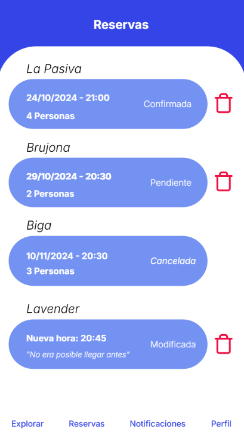

# Ingrey-Katz-Minetti-Symonds

# GESTIÓN DE LA ITERACIÓN

## Definición del Marco de Trabajo SCRUM

- SCRUM se elige como marco de trabajo ágil debido a su capacidad para gestionar cambios frecuentes y la iteración continua de ideas, ideal para el desarrollo de un prototipo de aplicación de reservas y evaluación de restaurantes. Al enfocarse en iteraciones cortas, permite que el equipo ajuste el enfoque en cada sprint según la retroalimentación del Product Owner y los avances en el diseño.

#### Roles del Equipo y Responsabilidades

- Product Owner (PO): Responsable de definir y priorizar las historias de usuario en el Product Backlog, asegurando que cada funcionalidad esté alineada con los objetivos del proyecto y las necesidades de los usuarios.
    -  Integrante: Federico Katz

- Scrum Master (SM): Facilita el cumplimiento del marco de trabajo, asegurando que el equipo siga las prácticas acordadas y resolviendo cualquier obstáculo que pueda surgir. Promueve la mejor a continua a través de retrospectivas y seguimiento de la dinámica del equipo.
    - Integrante: Gastón Minetti

- Equipo de Desarrollo: 
Conformado por los miembros encargados de diseñar y prototipar las funcionalidades, siguiendo las historias priorizadas. Trabajan en cada iteración para completar el Sprint Backlog y asegurar que las entregas cumplan con el Definition of Done (DoD).
Integrantes:
    - Christian Ingrey
    - Emily Symonds

#### Definition of Ready (DoR)

Para que una historia de usuario esté lista para ser trabajada en el prototipo:
- **Narrativa completa y clara:** La historia de usuario debe especificar quién es el usuario, qué quiere lograr y el beneficio o propósito de la funcionalidad (por ejemplo: "Como usuario registrado, quiero recibir notificaciones de promociones para aprovechar descuentos en mis restaurantes favoritos").

- **Criterios de aceptación bien definidos:** La historia debe incluir al menos un escenario de aceptación claro que detalle las condiciones exactas en las que se considerará que la funcionalidad está cumplida.
Especificación de flujo de usuario: El flujo de interacción debe estar detallado desde el primer paso hasta el final, describiendo cómo el usuario interactúa con cada elemento y las pantallas involucradas.
- **Contenido y textos definidos:** Se deben definir todos los textos que aparecerán en la interfaz, incluyendo etiquetas, mensajes y cualquier otro texto que oriente al usuario durante la experiencia.
- **Aprobación del Product Owner:** El Product Owner debe haber revisado y aprobado la historia, asegurando que es relevante, prioritaria y clara para ser trabajada en el prototipo.

#### Definition of Done (DoD)

Para que una historia de usuario esté finalizada en el prototipo:
- **Pantallas y flujo de interacción completados:** Todas las pantallas necesarias están diseñadas en Framer, reflejando fielmente el flujo descrito en los criterios de aceptación y el flujo de usuario detallado en la historia.
- **Interactividad simulada en Framer:** Las interacciones principales están configuradas en Framer, permitiendo una experiencia de usuario que simula los pasos descritos, incluyendo navegación entre pantallas y elementos interactivos, como botones y formularios.
- **Contenido y textos implementados:** Todos los textos definidos en la historia (etiquetas, mensajes, placeholders) están implementados en el prototipo, asegurando que orientan al usuario según lo especificado.
- **Experiencia revisada y aprobada por el Product Owner:** El Product Owner ha revisado el prototipo en Framer y ha confirmado que cumple con los criterios de aceptación y que la experiencia de usuario sigue el flujo especificado.
- **Exportación del prototipo:** El prototipo ha sido exportado en formato de imagen (PNG o JPG) o PDF, y se ha cargado en el repositorio de GitHub para permitir su visualización y consulta por el equipo y las partes interesadas.
- **Documentación de decisiones de diseño en Framer:** Se han añadido comentarios en el proyecto de Framer para documentar cualquier decisión de diseño o cambio significativo en el flujo, asegurando que el equipo y el Product Owner puedan comprender fácilmente el enfoque tomado en el prototipo.

## Planificación de la iteración

El Sprint Backlog contiene las historias de usuario priorizadas y las tareas necesarias para cumplir con el objetivo de la iteración: construir y validar posibles soluciones del MVP mediante prototipos. Estas historias de usuario han sido priorizadas de acuerdo a su impacto en el producto final y alineación con los objetivos de negocio. Las tareas se planificaron basándose en la capacidad y velocidad del equipo, tomando en cuenta las horas disponibles de cada integrante y las actividades paralelas que puedan afectar su disponibilidad.

Antes de comenzar la iteracion, el equipo se reunió para revisar el Product Backlog y seleccionar las historias de usuario que se abordarán en el Sprint Backlog. Se priorizaron las historias que aportan mayor valor al MVP y se estimaron las tareas necesarias para completarlas. A continuación, se detallan las historias de usuario seleccionadas.

### Resumen del sprint planning
En el sprint planning se reviso el product backlog, con un foco en identificar y seleccionar las user stories que aportan mayor valor a los objetivos del MVP de la aplicación. 

Se definio el Sprint Backlog con un conjunto de user stories y tareas asociadas. De cada tarea se estimo el tiempo requerido y asignando responsables para asegurar un buen flujo de trabajo

Cabe aclarar que se reservo un tiempo de revision de avance, para asi poder obtener feedback y asi ajustar lo que se considere necesario.

### Objetivos de la Iteración

- Crear prototipos que presenten soluciones potenciales para el MVP.
- Validar los prototipos con usuarios mediante pruebas de usabilidad.
- Realizar ajustes basados en el feedback recibido para optimizar las soluciones.
- Asegurar que los prototipos sigan una linea visual y estetica cosistente.

### Sprint backlog
Para esta iteración, se han priorizado historias de usuario enfocadas en el flujo de autenticación, reserva y administración de restaurantes. Estas historias y tareas permitirán ofrecer una experiencia de usuario robusta y simplificar la administración para los gerentes de los restaurantes. A continuación se detalla el Sprint Backlog con las historias de usuario seleccionadas y sus tareas específicas asociadas para facilitar la implementación y cumplir con los criterios de aceptación.

Historia de Usuario 12: Visualizar perfil

- Tareas:
Crear una interfaz para que un usuario visualize su perfil, una vez que se encuentre logueado en la aplicación.

Realizada por Christian Ingrey

Historia de Usuario 2: Recuperar contraseña

- Tareas:
Diseñar interfaz para que un usuario recupere su contraseña en caso de que la haya olvidado, que debe ser accesible desde la sección para iniciar sesión.
Crear formulario para ingresar el email.

Realizada por Christian Ingrey

Historia de Usuario 1: Login del sistema

- Tareas:
Implementar formulario de registro con campos para correo electrónico, nombre de usuario y contraseña.
Integrar autenticación con Google.
Configurar el envío de correos de confirmación para el registro por correo electrónico.
Crear validaciones para los datos de registro.
Realizar pruebas de registro y validación de cuenta.
Documentar flujo de registro y autenticación.

Realizada por Federico Katz

Historia de Usuario 3: Logout del sistema

- Tareas:
Crear funcionalidad para cerrar sesión del usuario.
Redirigir a la pantalla de inicio de sesión al cerrar sesión.
Realizar pruebas de cierre de sesión para verificar el flujo completo.
Documentar proceso de cierre de sesión y seguridad de datos.

Realizada por Christina Ingrey

Historia de Usuario 5: Realizar una reserva en un restaurante

- Tareas:
Diseñar interfaz para seleccionar restaurante, fecha, hora y número de personas.
Implementar lógica para procesar la reserva y asignar mesa disponible.
Configurar notificación de confirmación de reserva para el usuario.
Validar disponibilidad en tiempo real para evitar reservas duplicadas.
Realizar pruebas de reserva y confirmación.
Documentar proceso de reserva y gestión de disponibilidad.

Realizada por Federico Katz

Historia de Usuario 13: Cancelación de una reserva

- Tareas:
Implementar funcionalidad de cancelación de reservas en la sección de perfil.
Configurar mensajes de confirmación de cancelación y política de cancelación.
Crear validación para mostrar restricciones de cancelación (por ejemplo, límite de 24 horas).
Realizar pruebas de cancelación y gestión de mensajes de error.
Documentar el flujo de cancelación y política de restaurante.

Realizada por Emily Symonds

Historia de Usuario 14: Visualización de restaurantes disponibles

- Tareas:
Diseñar interfaz para buscar restaurantes por zona y ver valoración y precios.
Implementar opción de visualización en lista y mapa interactivo.
Configurar filtros de búsqueda por zona y ordenamiento por valoración.
Realizar pruebas de visualización y usabilidad.
Documentar proceso de búsqueda y visualización de restaurantes.

Realizada por Federico Katz

Historia de Usuario 16: Confirmación de reserva por parte del gerente

- Tareas:
Implementar notificación de nuevas reservas en la vista del gerente.
Crear sección para que el gerente pueda revisar y confirmar reservas.
Diseñar interfaz para mostrar detalles de la reserva (fecha, hora, personas).
Actualizar estado de la reserva a "Confirmada" al finalizar la acción.
Realizar pruebas de confirmación y actualización de estado.
Documentar flujo de confirmación de reservas por el gerente.

Realizada por Emily Symonds

Historia de Usuario 17: Cancelación de reserva por parte del gerente

- Tareas:
Configurar opción de cancelación de reservas en la vista del gerente.
Implementar campo para que el gerente proporcione una razón para la cancelación.
Realizar pruebas de cancelación y visualización de motivos de cancelación.
Documentar flujo de cancelación de reservas por el gerente.

Realizada por Emily Symonds.

Historia de Usuario 18: Modificación de horarios disponibles

- Tareas:
Crear interfaz en "Administrar Restaurante" para modificar horarios de apertura y cierre.
Validar la entrada de horarios y manejar errores en el formato.
Actualizar la información de horarios en la plataforma en tiempo real.
Realizar pruebas de actualización y visualización de horarios.
Documentar el flujo de actualización de horarios.

Realizada por Gaston Minetti.

Historia de Usuario 19: Modificación de tipos de comida

- Tareas:
Crear interfaz en "Administrar Restaurante" para editar tipos de comida ofrecidos.
Configurar lista editable para los tipos de comida y validar las entradas.
Actualizar el perfil del restaurante en tiempo real con la nueva información.
Realizar pruebas de modificación de menú y actualización de vista de usuario.
Documentar el proceso de actualización de tipos de comida.

Realizada por Gaston Minetti.

### Planificación de equipo

El criterio en esta entrega, se baso en la disponibilidad de cada uno de los integrantes del grupo. Dicho esto, todas las tareas se dividieron de forma pareja, logrando que todos esten a cargo de ciertas features y que todos aportaran a la documentacion de forma acorde.

### Tecnicas de priorización y estimación

Para esta iteración, se emplearon técnicas de priorización que nos ayudaron a definir el orden de trabajo de las historias de usuario con el mayor impacto en el MVP. Las técnicas seleccionadas fueron:

Las historias de usuario se clasificaron de acuerdo con su valor para el usuario (impacto en la aplicación) y el esfuerzo estimado de desarrollo. Las historias que representaban alto valor y bajo esfuerzo recibieron la prioridad más alta, mientras que las de bajo valor y alto esfuerzo se postergaron para futuras iteraciones.

MoSCoW (Must have, Should have, Could have, Won’t have): Se utilizó esta técnica para dividir las historias de usuario en cuatro categorías:

- Must have: Historias esenciales para el MVP, que se seleccionaron como primera prioridad en el Sprint Backlog.
- Should have: Historias importantes, pero que podrían dejarse fuera si el tiempo no alcanzaba.
- Could have: Historias deseables, pero no imprescindibles, que se tomarán en cuenta en iteraciones posteriores.
- Won’t have (this time): Funcionalidades que no fueron consideradas para esta iteración, pero podrían implementarse en el futuro.

Esta combinación de técnicas nos permitió priorizar eficientemente las historias más relevantes, centrándonos en los elementos críticos para avanzar en el desarrollo del MVP.

Por otro lado, los puntos de historia se usaron para asignar un valor relativo de esfuerzo a cada tarea, sin relacionarlos directamente con horas específicas. Esto nos permitió establecer comparaciones y balancear la carga de trabajo en función de la capacidad del equipo. Las tareas más complejas recibieron una puntuación más alta, indicando su mayor complejidad y tiempo de desarrollo.

### Metricas relevantes
1. Velocidad del Equipo
    
    Comotodavia no tenemos sprints anteriores de los que podamos estimar la velocidad del equipo, se decidio estimar 30 puntos en una iteración de dos semanas. Esto nos permitio ajustar el Sprint Backlog, asegurando que las tareas se alinearan con la capacidad real del equipo sin sobrecargarlo. Como tuvimos que realizar cambios en el backlog como se explicó anteriormente, se la velocidad del equipo final fue de 26 puntos para esta iteración.

2. Productividad del Equipo

    La productividad se midió comparando tareas completadas vs. planeadas, permitiendo ajustes semanales en el backlog. Si algún retraso afectaba la productividad, se revaluaban las prioridades para mantener el enfoque en los objetivos principales del sprint.

3. Resultados y Lecciones Aprendidas

    Estas métricas permitieron planificar de forma más precisa y ajustar el trabajo en tiempo real, asegurando un avance constante en el MVP. Para futuras iteraciones, se implementarán revisiones de velocidad y gráficos de avance semanal (burndown charts) para mejorar la eficiencia en el control del progreso del sprint.

## Seguimiento de la iteración

Gaston Minetti:

Emily Symonds:

Federico Katz:

Christian Ingrey:

## Inspección y adaptación del proceso

En el sprint meeting realizado el 22 de agosto, el equipo discutió el estado de las tareas actuales y la posible reestructuración de algunas historias de usuario:

Durante la retrospectiva realizada una vez terminado el sprint, se concluyó que las historias de usuario no completadas en el sprint actual (particularmente las de registro de gerente y alta de restaurantes) tendrán prioridad en el siguiente sprint, siempre y cuando se resuelvan las consultas pertinentes con el profesor. Esta decisión se tomó con el objetivo de asegurar el avance estratégico de las funcionalidades clave y optimizar el flujo de trabajo en los próximos sprints.

# Construcción y validación de posibles soluciones del MVP a través de prototipos

## Posibles soluciones de MVP con prototipos
En esta iteración, se decidio realizar los prototipos de la aplicación utilizando Framer. Esta plataforma nos permite colaborar en tiempo real sobre el mismo proyecto, lo que facilita la elaboración de bocetos para los requisitos definidos en la iteración anterior y acelera y estimula el proceso de diseño.

El prototipo aún se encuentra en una fase preliminar, por lo que puede sufrir modificaciones. Nos enfocamos en hacer las funcionalidades de mayor prioridad, abarcando tanto las dirigidas a los administradores como a los usuarios. Algunas de estas features son la de explorar restaurantes, realizar una reserva, confirmar o cancelar la misma, editar los tipos de comida disponibles, etc. 

A continuación se muestran las imagenes de dicho prototipo. 

## Inspección y adaptacion del producto

Con el fin de comprender mejor las expectativas de los usuarios, se decidio realizar una entrevista a Nacho Perez, estudiante de de medicina en la Facultad de Medicina. La entrevista tuvo como objetivo recoger información sobre sus experiencias con reservas en restaurantes, las dificultades que enfrenta, y las características que le gustaría ver en una aplicación de reservas para optimizar y hacer que su experiencia sea mas agradable.

A continuación, se presentan las preguntas realizadas durante la entrevista, junto con sus respectivas respuestas, que serán de ayuda para ajustar el diseño y las funcionalidades de la aplicación en las próximas iteraciones, asi como lograr entender de mejor manera que es lo que se espera de la aplicación y obtener nuevas features a tener en cuenta.

### Entrevista

**¿Cuál es la mayor dificultad que encuentras al hacer reservas en restaurantes actualmente?**

Lo más complicado para mí es que algunos restaurantes solo aceptan reservas por teléfono, y a veces no logro encontrar el contacto en google, ya sea por que no esta disponible u otra razon.

**¿Qué funcionalidades te gustaría ver en una aplicación que facilite las reservas?**

Me gustaría que la aplicación me permita ver de rapidamente las horas disponibles de un cierto restaurante, que me avise si hay algún cambio en mi reserva y que tenga una opción de cancelación rápida en caso de que no pueda asistir. Ademas me pareceria una funcionalidad increible si se puede comunicar con el restaurante dentro de la aplicación mismo.

**¿Te interesaría recibir notificaciones sobre nuevos restaurantes o eventos especiales como promociones?**

Sí, me encantaría que me sugirieran lugares nuevos, sobre todo si están cerca de mi ubicación y ofrecen algo diferente o especial.

**¿Conoces alguna aplicación similar que ya esté en uso en el país?**

Obviamente hay muchas aplicaciones del estilo, como PedidoYa. Pero a diferencia de ellas, esta me parece mas enfocada en reservas, y no en delivery o pedidos online.

**¿Qué información te gustaría ver en el perfil de un restaurante antes de hacer una reserva?**

Me gustaría ver fotos del lugar, el tipo de cocina que ofrece, un rango de precios, y, sobre todo, las reseñas de otros usuarios. También sería útil saber si tienen opciones vegetarianas o veganas.

**¿Te gustaría poder reservar diferentes áreas del restaurante (por ejemplo, terraza, interior, zona para fumadores)?**

Sí, me encantaría. A veces prefiero estar en una terraza si el clima está bien o en una zona tranquila si estoy con amigos.

**¿Qué tan importante es para ti la posibilidad de modificar tu reserva una vez hecha?**

Es fundamental. A veces los planes cambian, y es frustrante cuando no puedes modificar la reserva o cambiar el número de personas.

**¿Qué nivel de personalización esperas de las recomendaciones? (por ejemplo, basadas en tu historial de reservas, preferencias de comida, presupuesto)**

Me gustaría que se personalicen según mis gustos y presupuesto. Si he reservado varias veces en un restaurante de comida italiana, que me sugieran otros lugares similares sería útil.