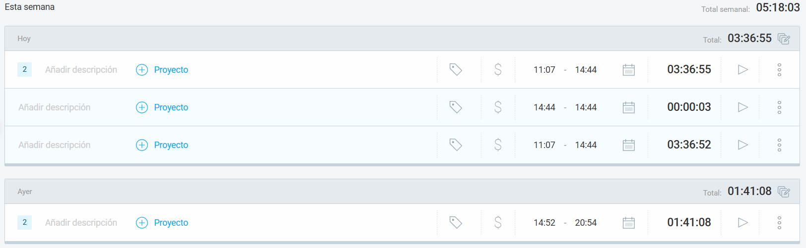
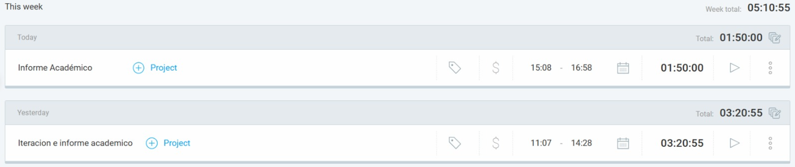

# Ingrey-Katz-Minetti-Symonds

# Gestión de la iteración
## Definición del Marco de Trabajo

SCRUM se utilizó como marco de trabajo ágil debido a su enfoque iterativo y su capacidad para gestionar la inspección y adaptación constantes, lo cual resultó esencial durante el desarrollo del prototipo de la aplicación de reservas y evaluación de restaurantes. En esta iteración final, el marco SCRUM permitió consolidar los aprendizajes de las iteraciones previas, realizar ajustes finales al prototipo y documentar los resultados obtenidos.

**Evidencia de Prácticas Aplicadas:**

**Roles del Equipo Y Responsabilidades**

- Product Owner (PO): Responsable de revisar y validar los entregables finales, priorizando los elementos que debían consolidarse en el informe académico y el video demo. Además, facilitó la recopilación de feedback clave durante las revisiones.
    - Integrante: Federico Katz
- Scrum Master (SM): Aseguró que el equipo cumpliera con los eventos y las prácticas de SCRUM durante la iteración final, promoviendo la reflexión y mejora continua en las retrospectivas. También facilitó la coordinación para la integración de los entregables en el repositorio principal.
    - Integrante: Gastón Minetti
- Equipo de Desarrollo: Se encargó de completar los ajustes finales del prototipo, diseñar el video demo y elaborar el informe académico. Además son los encargados de asegurar que las entregas cumplan con el Definition of Done (DoD).
    - Integrantes: Christian Ingrey y Emily Symonds

## Artefactos Principales
**Justificación de las Adaptaciones Principales del Marco de Trabajo**

En esta iteración, se adaptaron algunos eventos y prácticas del marco SCRUM para ajustarse al objetivo principal de cerrar el proyecto:
- Se redujo la frecuencia de las Daily Scrums para poder dedicarle más tiempo a los entregables clave.
- Se priorizo la finalización del informe académico y el video de demostración.
- Se dio lugar a la retroalimentación del Product Owner sobre eventos como la validación con usuarios externos.
- La retrospectiva se utilizó para analizar de forma más profunda las lecciones aprendidas a lo largo de todo el proyecto, con énfasis en cómo estas podrían aplicarse en futuros proyectos o experiencias.

**Definición del Calendario de Eventos**

- Daily Scrum: Se realizó una única daily, dado al hecho de que quedan solamente dos requerimientos, por lo que el equipo no considero necesario hacer más. Aquí se priorizaron la resolución de impedimentos y de tareas críticas.
- Sprint Planning: Se definieron claramente las tareas necesarias para completar el informe académico y el video, dando una priorización acorde.
- Sprint Review: Se realizó al finalizar la iteración para validar el informe académico y la demo con el product owner.
- Retrospectiva: Se discutieron los aprendizajes clave y las mejoras aplicables en futuros proyectos y experiencias.

**Políticas de Trabajo en Equipo**

Definition of Done (DoD)
- Informe académico: debe ser en formato Markdown y organizado en secciones claras. El contenido debe reflejar los objetivos del proyecto y aprendizajes claves. Por último, el archivo debe estar revisado, aprobado y disponible en el repositorio Github.
- Video de demostración: debe estar grabado, teniendo una duracion maxima de 6 minutos. Tiene que demostrar el flujo principal del prototipo, explicando que busca resolver y el valor agregado por la solución. Al igual que el informe académico, debe ser adjuntado en el repositorio.
- Prototipo final: incorpora los cambios sugeridos por usuarios como amigos y familiares. Debe estar revisado y aprobado por el product owner.
- Trabajo integrado: debe estar todo integrado en la rama main del repositorio en Github.

Definition of Ready (DoR)
- Tareas claramente definidas: con criterios de aceptación específicos. El alcance del informe debe estar claro, incluyendo las secciones a completar.
- Recursos necesarios: deben estar disponibles los recursos como prototipos y comentarios previos, tanto de feedback como de correcciones.

## Planificación de la iteración

### Minuta de la Sprint Planning

**Agenda:**
- Revisión de los objetivos de la iteración.
- Priorización de historias de usuario pendientes.
- Estimación de tareas para las historias seleccionadas.
- Distribución de responsabilidades según capacidad del equipo.
- Planificación del seguimiento y criterios de éxito.

**Actividades Realizadas:**
- Revisión de las tareas pendientes en el backlog y las nuevas historias priorizadas.
- Estimación de las tareas utilizando la técnica de Planning Poker.
- Creación del cronograma de trabajo basado en la dificultad de la tarea y disponibilidad de cada integrante.

**Resultados:**
- Sprint Backlog definido con las historias de usuario seleccionadas.
- Asignación clara de tareas para cada miembro del equipo.
- Establecimiento de métricas de seguimiento, como la velocidad proyectada del equipo.

### Objetivos de la Iteración
- Implementar las funcionalidades relacionadas con la gestion de valoraciones y comentarios.
    - Permitir la apelación de las puntuaciones por parte de los gerenciadores.
    -Posibilidad de borrar dichas valoraciones que se consideren inapropiadas por parte de los administradores.
- Refinar y consolidar la experiencia de usuario de estas funcionalidades.

### Sprint Backlog
Para esta iteración se realizaron las historias de usuario relacionadas a las valoraciones y comentarios. Dichas historias habilitan a los gerenciadores de restaurantes apelar a una puntuación o comentario inapropiado. De esta forma el negocio no se vea afectado injustamente. Por lo tanto se provee una solucion mas robusta para los usuarios de tipo gerenciador. 

- Historia de Usuario: Apelación de puntuación o comentario
Tarea: Diseñar una pantalla para apelación de valoraciones y comentarios que permita seleccionar una puntuación y dar una razon del rechazo.

- Historia de Usuario: Administración de puntuación y comentarios
Tarea: Crear un flujo de eliminación de valoraciones y comentarios, para que sea posible por un administrador de la plataforma eliminar aquellas puntuaciones que sean inapropiadas.

### Planificación de acuerdo a la capacidad del equipo.
El criterio de planificación del equipo para esta entrega se baso en la disponibilidad de los integrantes y de la complejidad de las tareas a realizar. Dicho esto, todas las tareas se dividieron de forma equitativa, logrando que todos los integrantes del grupo aprotaran a la solución general.

### Técnicas de Priorización y Estimación Utilizadas
Para esta iteración, utilizamos técnicas de priorización enfocadas en maximizar el impacto de las funcionalidades relacionadas con la gestión de valoraciones y comentarios, centrándonos en aquellas que ofrecieran mayor valor para el usuario en el contexto del MVP.

**Priorización**
Las historias de usuario fueron clasificadas según su impacto en la aplicación y el esfuerzo estimado de desarrollo. Las funcionalidades críticas para cerrar el ciclo de desarrollo del MVP recibieron la mayor prioridad

**Técnica Utilizada:**
Se hizo uso de la técnica MoSCoW, que permitió dividir las historias en categorías claras, asegurando que el equipo trabajara en los elementos más importantes:

- Must have:
    - Apelación de valoraciones y comentarios por parte de gerenciadores.
    - Eliminación de valoraciones y comentarios por los administradores. Estas historias fueron esenciales para completar la funcionalidad central del MVP, por lo que se priorizaron en el Sprint Backlog.

- Should have:
    - Refinamiento de la interfaz de moderación para administradores.
    - alidación de notificaciones relacionadas con comentarios. Estas tareas fueron consideradas importantes pero podrían haberse ajustado según el tiempo disponible.

- Could have:
    - Mejoras adicionales en la navegación para facilitar la visualización de comentarios.

- Won't have: 
    - Funcionalidades avanzadas de análisis y reportes sobre valoraciones. Estas fueron postergadas para ser evaluadas en futuros desarrollos.

**Estimación:**

Para estimar las tareas asociadas a las historias de usuario, utilizamos puntos de historia como medida relativa del esfuerzo requerido. Este enfoque permitió evaluar la complejidad de las tareas sin depender directamente de horas específicas, lo que facilitó la planificación y balanceo de la carga de trabajo.

Esta combinación de MoSCoW y puntos de historia nos permitió priorizar eficientemente las historias clave, asegurando que los elementos críticos fueran desarrollados dentro del tiempo disponible y de acuerdo con la capacidad del equipo.

### Métricas Relevantes para la Planificación
- Velocidad del Equipo: En esta iteración final, el equipo estimó una capacidad de 20 puntos, dado que la naturaleza de las tareas (cierres finales, ajustes de funcionalidades y entrega de artefactos) requería un enfoque más detallado.
    - Todas las historias de usuario incluidas en el Sprint Backlog (apelación de comentarios y eliminación de valoraciones) se completaron exitosamente dentro del sprint.
La estimación fue precisa, ya que permitió alcanzar los objetivos de la iteración sin generar sobrecarga para los integrantes.

- Productividad del Equipo: 
La productividad se midió de acuerdo con:
    - Tareas completadas vs. planeadas: De las 2 historias de usuario planificadas, ambas se finalizaron satisfactoriamente.
    - Ajustes proactivos: Durante las Daily Scrums, se identificaron impedimentos menores que se resolvieron rápidamente, manteniendo el enfoque en los objetivos principales.
    - La equidad en la distribución de tareas permitió que cada miembro contribuyera de manera significativa según su rol y experiencia, mejorando el desempeño general.

- Resultados y Lecciones Aprendidas
Estas métricas ayudaron a:
    - Planificar con precisión: Estimaciones realistas basadas en las iteraciones previas permitieron alcanzar un balance óptimo entre carga de trabajo y tiempo disponible.
    - Adaptarse rápidamente: La productividad se mantuvo alta gracias al monitoreo constante y al enfoque en tareas críticas.
    - Cierre exitoso del proyecto: El equipo entregó todos los artefactos finales (informe académico, video demo y prototipo ajustado), lo que asegura un avance sólido hacia la defensa del MVP.

## Seguimiento de la iteración

### Minuta de las Daily Scrums

**Frecuencia:** Se realizó una unica Daily Scrums durante la iteración 4.

**Formato de las Reunion**

¿Qué logramos hacer?
- Los integrantes del equipo compartieron el avance en sus tareas asignadas.
- Se destacaron los historias de usuario completadas, como el desarrollo del flujo de apelaciones y la creación de la interfaz de eliminación de valoraciones y comentarios para los administradores.

¿Qué planificamos hacer?
- Se discutieron las tareas a completar antes de la finalización del proyecto, asignando prioridades según los objetivos del sprint.
- Una de estas tareas fue revisar el prototipo para validar que se ajusta al feedback recibido.

¿Qué impedimentos tenemos?
- Algunos problemas técnicos fueron identificados, como la necesidad de ajustar el diseño de la interfaz.

### Registro y Reporte de Horas

Clockify Christian Ingrey:

Clockify Federico Katz:

Clockify Gastón Minetti:

Clockify Emily Symonds:

### Seguimiento visual de la iteración con burndown y/o burnup charts.

## Inspección y adaptación del proceso

### Minuta de la retrospectiva

**Fecha:** Sabado 23 de noviembre a las 17 horas

**Asistentes:** Todos los integrantes del equipo

**Objetivo:** Identificar prácticas que funcionaron bien, aspectos que deben cambiar y nuevas estrategias a implementar.

**Desarrollo de la dinámica:**
- Cada miembro compartió observaciones sobre el proceso de trabajo.
- Se discutieron acciones concretas a implementar basadas en las observaciones.
- Se argumento la mejor forma de implementar dichas acciones para el beneficio del equipo.

**Resultados Principales:**

- Incorporar validaciones más frecuentes con usuarios para evitar ajustes tardíos en próximas iteraciones.
- Dedicar más tiempo al diseño inicial de historias de usuario, asegurando que sean claras y específicas desde el principio.
- Reducir el tiempo invertido en discusiones largas durante las Daily Scrums. Se propuso limitar cada reunión a un máximo de 20 minutos.
- Evitar sobrecargar a ciertos miembros del equipo con múltiples responsabilidades, distribuyendo tareas de manera más equitativa.
- Utilizar métricas como el burndown chart para monitorear el progreso y detectar atrasos a tiempo.
- Mantener las retrospectivas estructuradas, ya que facilitaron la mejora continua a lo largo del proyecto.

### Planificación y Seguimiento de Acciones de Mejora

**Acciones Identificadas e Implementadas:**

- Revisión de Historias de Usuario:
    - Planificación: A partir de la retrospectiva, se acordó que todas las historias deben pasar por una revisión previa con el Product Owner antes de agregarse al Sprint Backlog.
    - Seguimiento: Se aplicó este enfoque durante la iteración 4, lo que resultó en menos revisiones y correcciones a mitad de la iteración.

- Distribución Equitativa del Trabajo:
    - Planificación: Se asignaron tareas según las fortalezas individuales y la capacidad disponible de cada integrante, ajustando las responsabilidades iniciales.
    - Seguimiento: Se monitoreó el avance de cada miembro para evitar sobrecargas y asegurar una contribución balanceada. Con el equipo estando disponible para ayudar en cualquier situacion de dificultad.

- Optimización de las Daily Scrums:
    - Planificación: Establecer un límite estricto de 20 minutos para las reuniones y un enfoque exclusivo en problemas críticos.
    - Seguimiento: Esta práctica fue adoptada durante la iteración 4, mejorando la eficiencia sin comprometer la comunicación del equipo.

- Validaciones con Usuarios:
    - Planificación: Se programaron sesiones de validación al finalizar cada sprint para integrar feedback temprano en el prototipo.
    - Seguimiento: Aunque esta práctica no se implementó al 100% debido al tiempo limitado, se utilizó en iteraciones clave para ajustes de funcionalidad.

## Artefactos principales
### Prototipos interactivos finales con el feedback de las validaciones.
### Prototipos asociados como bocetos a las historias de usuario.

#### User Story 1
- **Como** usuario registrado
- **Quiero** realizar una reserva en un restaurante
- **Para** asegurarme de tener mesa disponible en la fecha y horario que deseo

#### User Story 2
- **Como** usuario de la aplicación
- **Quiero** visualizar los restaurantes disponibles en mi zona, junto con sus valoraciones y rango de precios
- **Para** elegir el mejor restaurante según mis preferencias.
  

#### User Story 3
- **Como** usuario registrado
- **Quiero** cancelar una reserva realizada previamente
- **Para** liberar la mesa que ya no utilizaré y evitar cargos innecesarios

#### User Story 4
- **Como** usuario registrado
- **Quiero** recibir notificaciones de recomendaciones diarias en base a mi historial de reservas y valoraciones
- **Para** descubrir nuevos restaurantes y platos que podrían interesarme

#### User Story 5
- **Como** un usuario final de la aplicación
- **Quiero** registrarme en la plataforma utilizando mi correo electrónico
- **Para** poder acceder a todas las funcionalidades y realizar reservas en restaurantes

#### User Story 6
- **Como** usuario registrado
- **Quiero** recuperar mi contraseña cuando la haya olvidado
- **Para** poder restablecer mi acceso a la aplicación sin perder mi cuenta.

#### User Story 7
- **Como** usuario registrado
- **Quiero** cerrar sesión en la aplicación
- **Para** proteger mis datos personales cuando no utilizo el servicio

#### User Story 8
- **Como** usuario registrado
- **Quiero** editar mi perfil
- **Para** actualizar mi información personal, como el avatar, nombre de usuario y restaurantes favoritos

#### User Story 9
- **Como** usuario registrado
- **Quiero** agregar restaurantes a mi lista de favoritos por zona
- **Para** poder acceder rápidamente a ellos y recibir notificaciones de promociones

#### User Story 10
- **Como** usuario registrado
- **Quiero** configurar mi usuario
- **Para** recibir notificaciones

#### User Story 11
- **Como** administrador de la plataforma 
- **Quiero** registrar gerentes para los restaurantes
- **Para** asegurar que haya un responsable asignado a un restaurante.

#### User Story 12
- **Como** usuario registrado
- **Quiero** ver las puntuaciones y comentarios de otros usuarios sobre los restaurantes
- **Para** tomar una decisión informada antes de hacer una reserva

#### User Story 13
- **Como** usuario registrado
- **Quiero** visualizar el estatus de mis reservas
- **Para** poder verificar si han sido confirmadas, modificadas o canceladas por el restaurante.

#### User Story 14
- **Como** gerente de un restaurante
- **Quiero** confirmar las reservas solicitadas por los clientes
- **Para** asegurar que las mesas están correctamente asignadas y optimizar la gestión de las reservas.

#### User Story 15
- **Como** gerente de un restaurante
- **Quiero** cancelar reservas en caso de fuerza mayor o problemas de disponibilidad
- **Para** asegurar una gestión eficiente de las mesas y mantener informados a los clientes.

#### User Story 16
- **Como** gerente de un restaurante
- **Quiero** modificar los horarios de atención del restaurante
- **Para** reflejar los cambios operativos y garantizar que los clientes siempre vean los horarios correctos

#### User Story 17
- **Como** gerente de un restaurante
- **Quiero** modificar los tipos de comida que ofrece mi restaurante
- **Para** reflejar cambios en el menú o nuevas ofertas y asegurar que los clientes vean la información actualizada.

#### User Story 18
- **Como** gerente de un restaurante
- **Quiero** apelar una puntuación o comentario injusto que recibe mi restaurante
- **Para** proteger la reputación del restaurante y solicitar una revisión adecuada.

#### User Story 19
- **Como** gerente de un restaurante
- **Quiero** recibir notificaciones cuando se solicite una reserva en mi restaurante
- **Para** poder gestionar las reservas de manera eficiente y garantizar la asignación adecuada de mesas.

#### User Story 20
- **Como** gerente de un restaurante
- **Quiero** crear promociones para mi restaurante que serán visualizadas por los clientes
- **Para** atraer más clientes durante ciertos horarios o días específicos.

#### User Story 21
- **Como** administrador de la plataforma
- **Quiero** dar de alta nuevos restaurantes, indicando su dirección, tipo de comida y horarios
- **Para** que los clientes puedan hacer reservas y ver la información actualizada del restaurante.

#### User Story 22
- **Como** administrador de la plataforma
- **Quiero** dar de alta a gerentes para los restaurantes
- **Para** asegurar que cada restaurante esté gestionado correctamente y que los gerentes puedan administrar reservas, promociones y comentarios.

#### User Story 23
- Como administrador de la plataforma
- Quiero modificar la información de los gerentes asignados a un restaurante o reasignar gerentes a otros restaurantes
- Para asegurar que la gestión de los restaurantes sea actualizada y efectiva.

#### User Story 24
- **Como** administrador de la plataforma
- **Quiero** indicar qué restaurantes pueden aceptar reservas
- **Para** controlar cuáles restaurantes están habilitados para recibir reservas y permitir que los clientes hagan reservas solo en esos restaurantes.

#### User Story 25
- **Como** administrador de la plataforma
- **Quiero** gestionar los comentarios y puntuaciones que los clientes dejan en los restaurantes
- **Para** asegurarse de que las reseñas sean apropiadas y cumplan con las políticas de la plataforma.

#### User Story 26
- **Como** usuario registrado
- **Quiero** recibir notificaciones de promociones de mis restaurantes favoritos 
- **Para** estar informado de las mejores ofertas

#### User Story 27
- **Como** usuario registrado
- **Quiero** visualizar mi perfil que incluya nombre de usuario, avatar, restaurantes favoritos, recomendaciones realizadas y mi historial de visitas a restaurantes
- **Para** revisar y gestionar mi actividad dentro de la aplicación

### Lista de posibles características (features) que quedaron fuera del alcance del proyecto para expandir el sistema y agregar valor:
#### Colaboración y Redes Sociales
- El cliente comentó sobre que los gerenciadores y usuarios podrían:
  - Compartir en Redes: Integrar botones para compartir contenido en redes sociales.
  - Comentarios y Reseñas: Permitir a los usuarios comentar o reseñar elementos dentro del sistema.

  Esto le permitirá dar a los restaurantes una forma de crecer y poder llegar a diferentes consumidores.

#### Reportes y Analíticas
- Por otro lado, el cliente dijo que los gerenciadores al igual que los administradores deberían de poder tener:
  - Dashboards: Implementar paneles con estadísticas clave para los gerenciadores o administradores (cantidad de reservas, actividad de usuarios, restaurantes con mejor recomendaciones y calificaciones, etc.).
  - Reportes Automáticos: Enviar reportes periódicos sobre estas estadísticas así se automatiza el proceso, además de poder consumir estas estadísticas en cualquier momento.

#### Soporte Multilingüe: 
- El cliente también informó que para la expansión a nuevos mercados:
  - Ampliar el soporte de idiomas en la plataforma. Actualmente está todo en español y estaría bueno poder extender para la traducción a varios otros idiomas.

#### Monetización y Modelos de Negocio
- Por otro lado también se informó que para expandir su negocio necesitaba generar más dinero y comentó sobre la posibilidad de:
  - Planes de Suscripción: Ofrecer características premium bajo diferentes planes de suscripción. Por ejemplo, que los gerenciadores con planes premium sean los que puedan acceder a las estadísticas. 

#### Seguridad y Confianza
- Por último el cliente estaba preocupado por la seguridad del sistema si todo esto se vaya a escalar y informo que quería incluir:
  - Autenticación Multifactor: Asegurar las cuentas con autenticación adicional como OTP o biometría.
  - Historial de Acceso: Mostrar un registro de inicios de sesión y actividades importantes para los administradores, esto también aportaría buenas estadísticas para poder ver cómo se comportan los usuarios para luego poder mejorar los planes de monetización.
